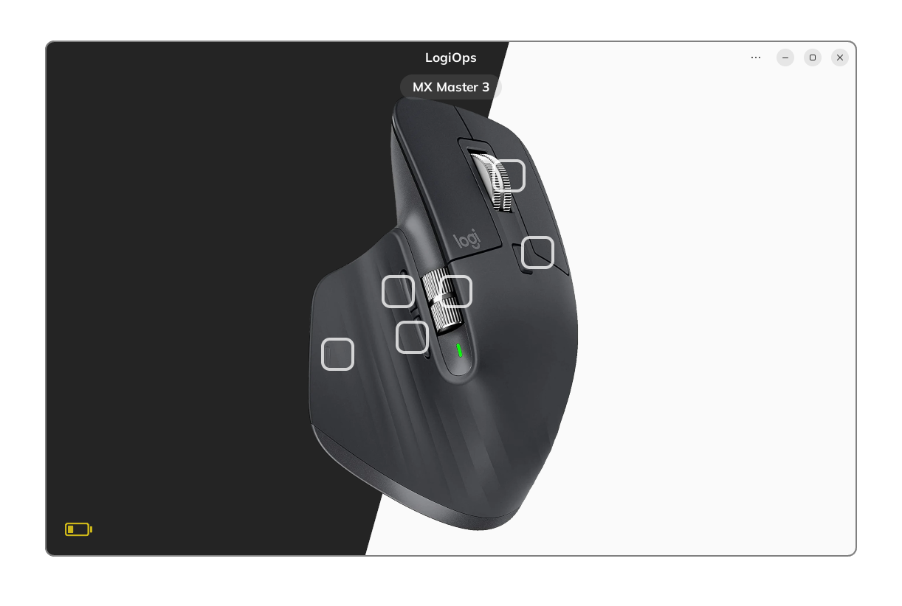
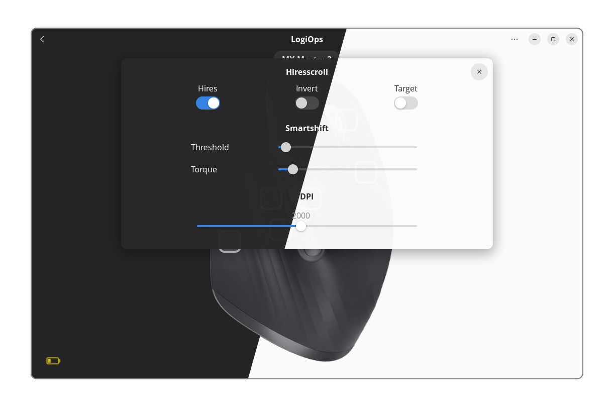

# LogiOps

#### UI configurator for [PixelOne/LogiOps](https://github.com/PixlOne/logiops)

:warning:__`This project is under development`__:warning:

>###### Help resources
>
>- [PixelOne/LogiOps](https://github.com/PixlOne/logiops) - *unofficial driver for Logitech*
>- [Working With Meson in CLion](https://blog.jetbrains.com/clion/2021/01/working-with-meson-in-clion-using-compilation-db/)
